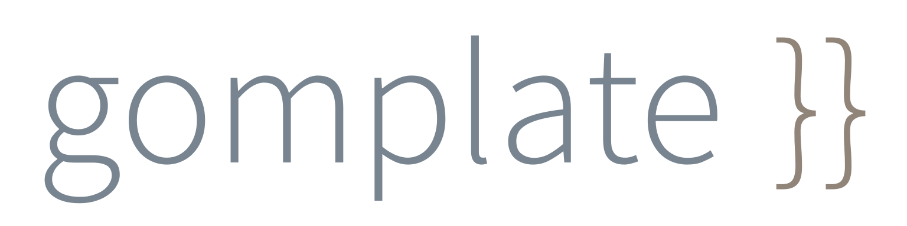

_Read the docs at [docs.gomplate.ca][docs-url], chat with developers and community in the [#gomplate channel][] on [Gophers Slack][]_

[![Build][gh-actions-image]][gh-actions-url]
[![Go Report Card][reportcard-image]][reportcard-url]
[![Codebeat Status][codebeat-image]][codebeat-url]
[![Coverage][gocover-image]][gocover-url]
[![Total Downloads][gh-downloads-image]][gh-downloads-url]
[![CII Best Practices][cii-bp-image]][cii-bp-url]

[![DockerHub Pulls][dockerhub-pulls-image]][dockerhub-url]

[](https://chocolatey.org/packages/gomplate)
[](https://chocolatey.org/packages/gomplate)

[![Install Docs][install-docs-image]][install-docs-url]
[![Slack][slack-image]][slack-url]
[![Discussions][discussions-image]][discussions-url]

`gomplate` is a template renderer which supports a growing list of datasources,
such as: JSON (_including EJSON - encrypted JSON_), YAML, AWS EC2 metadata,
[Hashicorp Consul](https://www.consul.io/) and [Hashicorp Vault](https://www.vaultproject.io/) secrets.

Come chat with developers and community in the [#gomplate channel][] on [Gophers Slack][] and on [GitHub Discussions][discussions-url]!

Here are some hands-on examples of how `gomplate` works:

```console
$ # at its most basic, gomplate can be used with environment variables...
$ echo 'Hello, {{ .Env.USER }}' | gomplate
Hello, hairyhenderson

$ # but that's kind of boring. gomplate has tons of functions to do useful stuff, too
$ gomplate -i 'the answer is: {{ mul 6 7 }}'
the answer is: 42

$ # and, since gomplate uses Go's templating syntax, you can do fun things like:
$ gomplate -i '{{ range seq 5 1 }}{{ . }} {{ if eq . 1 }}{{ "blastoff" | toUpper }}{{ end }}{{ end }}'
5 4 3 2 1 BLASTOFF

$ # the real fun comes when you use datasources!
$ cat ./config.yaml
foo:
  bar:
    baz: qux
$ gomplate -d config=./config.yaml -i 'the value we want is: {{ (datasource "config").foo.bar.baz }}'
the value we want is: qux

$ # datasources are defined by URLs, and gomplate is not limited to just file-based datasources:
$ gomplate -d ip=https://ipinfo.io -i 'country code: {{ (ds "ip").country }}'
country code: CA

$ # standard input can be used as a datasource too:
$ echo '{"cities":["London", "Johannesburg", "Windhoek"]}' | gomplate -d city=stdin:///in.json -i '{{ range (ds "city").cities }}{{.}}, {{end}}'
London, Johannesburg, Windhoek, 

$ # and here's something a little more complicated:
$ export CITIES='city: [London, Johannesburg, Windhoek]'
$ cat in.tmpl
{{ range $i, $city := (ds "cities").city -}}
{{ add 1 $i }}: {{ include "weather" (print $city "?0") }}
{{ end }}
$ gomplate -d 'cities=env:///CITIES?type=application/yaml' -d 'weather=https://wttr.in/?0' -H 'weather=User-Agent: curl' -f in.tmpl
1: Weather report: London

    \  /       Partly cloudy
  _ /"".-.     4-7 °C
    \_(   ).   ↑ 20 km/h
    /(___(__)  10 km
               0.0 mm

2: Weather report: Johannesburg

    \  /       Partly cloudy
  _ /"".-.     15 °C
    \_(   ).   ↘ 0 km/h
    /(___(__)  10 km
               2.2 mm

3: Weather report: Windhoek

    \  /       Partly cloudy
  _ /"".-.     20 °C
    \_(   ).   ↑ 6 km/h
    /(___(__)  20 km
               0.0 mm
```

Read the documentation at [docs.gomplate.ca][docs-url], and join the discussion
in [GitHub Discussions][discussions-url]!

_Please report any bugs found in the [issue tracker](https://github.com/hairyhenderson/gomplate/issues/)._

## License

[The MIT License](http://opensource.org/licenses/MIT)

Copyright (c) 2016-2023 Dave Henderson

[gh-actions-image]: https://github.com/hairyhenderson/gomplate/workflows/Build/badge.svg?branch=main
[gh-actions-url]: https://github.com/hairyhenderson/gomplate/actions?workflow=Build&branch=main

[reportcard-image]: https://goreportcard.com/badge/github.com/hairyhenderson/gomplate
[reportcard-url]: https://goreportcard.com/report/github.com/hairyhenderson/gomplate
[codebeat-image]: https://codebeat.co/badges/39ed2148-4b86-4d1e-8526-25f60e159ba1
[codebeat-url]: https://codebeat.co/projects/github-com-hairyhenderson-gomplate
[gocover-image]: https://gocover.io/_badge/github.com/hairyhenderson/gomplate
[gocover-url]: https://gocover.io/github.com/hairyhenderson/gomplate
[gh-downloads-image]: https://img.shields.io/github/downloads/hairyhenderson/gomplate/total.svg
[gh-downloads-url]: https://github.com/hairyhenderson/gomplate/releases

[cii-bp-image]: https://bestpractices.coreinfrastructure.org/projects/337/badge
[cii-bp-url]: https://bestpractices.coreinfrastructure.org/projects/337

[dockerhub-url]: https://hub.docker.com/r/hairyhenderson/gomplate
[dockerhub-pulls-image]: https://img.shields.io/docker/pulls/hairyhenderson/gomplate.svg

[docs-url]: https://docs.gomplate.ca
[install-docs-image]: https://img.shields.io/badge/install-docs-blue.svg
[install-docs-url]: https://docs.gomplate.ca/installing

[Gophers Slack]: https://invite.slack.golangbridge.org
[#gomplate channel]: https://gophers.slack.com/messages/CGTR16RM2/

[slack-image]: https://img.shields.io/badge/slack-gophers/%23gomplate-00ADD8.svg?logo=slack
[slack-url]: https://gophers.slack.com/messages/CGTR16RM2/

[discussions-image]: https://img.shields.io/badge/discussions-gomplate-blue.svg?logo=github
[discussions-url]: https://github.com/hairyhenderson/gomplate/discussions

[](https://github.com/igrigorik/ga-beacon)
