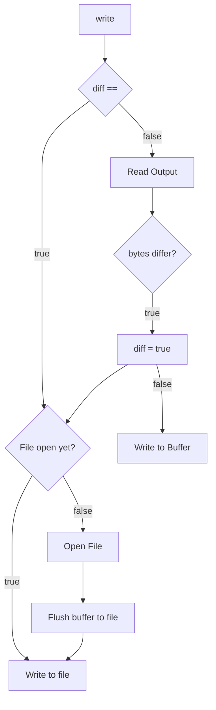

```mermaid
graph TD
  A[write] --> B{diff ==}
  B -->|true| C{File open yet?}
  B -->|false| BB
  DF[Write to file]

  C -->|true| DF
  C -->|false| E[Open File]
  E --> F[Flush buffer to file]
  F --> DF
	
  BB[Read Output] --> BC{bytes differ?}
  BC -->|true| BD[diff = true]
  BD -->|false| DB[Write to Buffer]
  BD --> C
```
