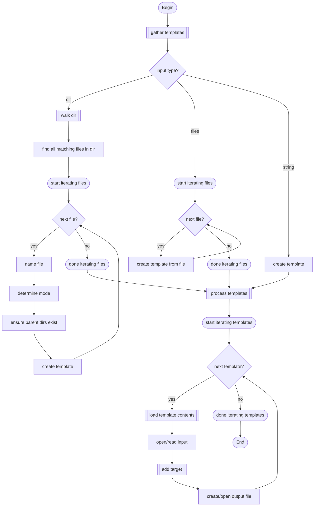

1. "gather templates" - gather and prepare inputs and outputs for rendering
    - 

```mermaid
flowchart TB
  S([Begin]) --> A
  A[[gather templates]] --> B
  B{input type?} -->|dir| BA
  B -->|files| BB
  B -->|string| BC

  D([End])

  C[[process templates]] --> CA
  CA([start iterating templates]) --> CAA

  CAA{next template?} -->|yes| CAB
  CAA -->|no| CAD

  CAD([done iterating templates]) --> D
  
  CAB[[load template contents]] --> CABA
  CABA[open/read input] --> CAC
  
  CAC[[add target]] --> CACA
  CACA[create/open output file] --> CAA
  
  BA[[walk dir]] --> BAA
  BAA[find all matching files in dir] --> BAB
  BAB([start iterating files]) --> BABA
  BABA{next file?} -->|yes| BABAA
  BABA -->|no| BAC
  BAC([done iterating files]) --> C

  BABAA[name file] --> BABAB
  BABAB[determine mode] --> BABAC
  BABAC[ensure parent dirs exist] --> BABAD
  BABAD[create template] --> BABA

  BB([start iterating files]) --> BBA
  BBA{next file?} -->|yes| BBAA
  BBA -->|no| BBD
  BBD([done iterating files]) --> C

  BBAA[create template from file] --> BBA

  BC[create template] --> C
```
